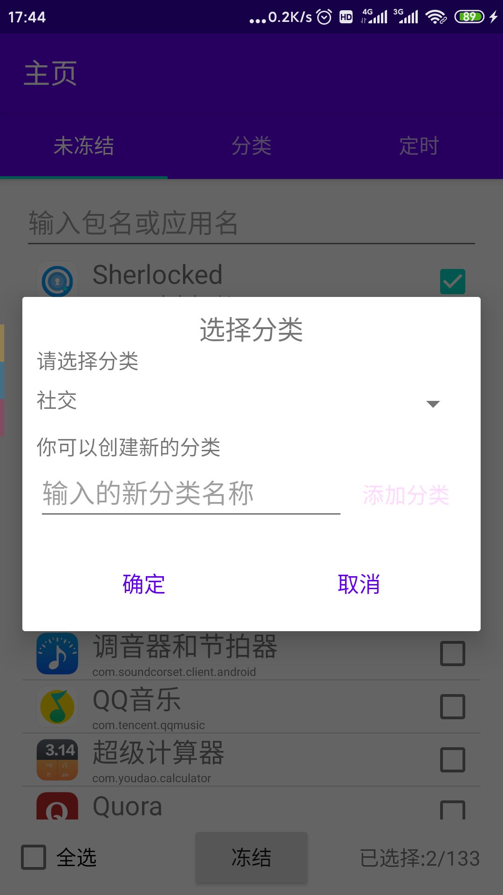
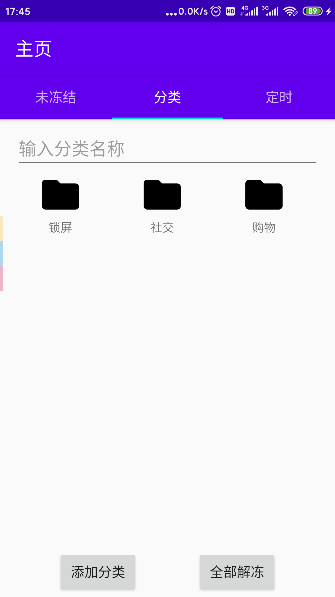
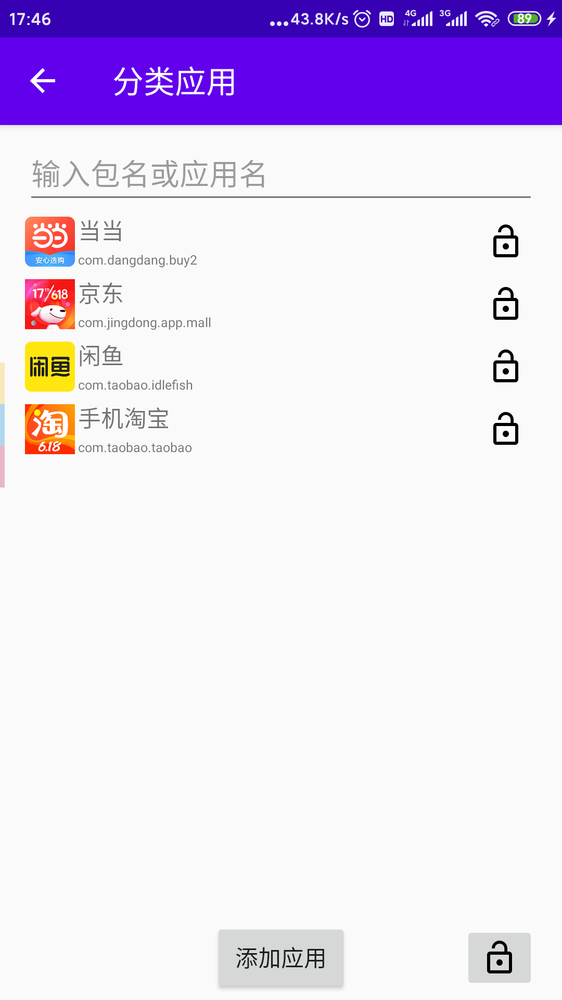
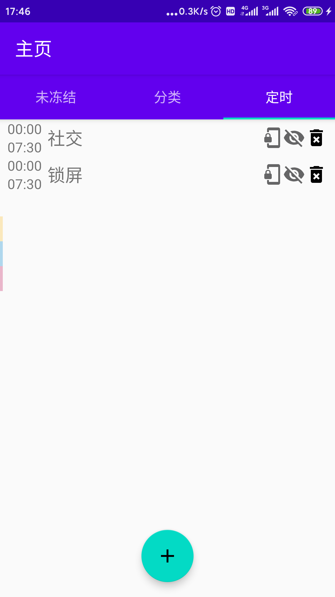
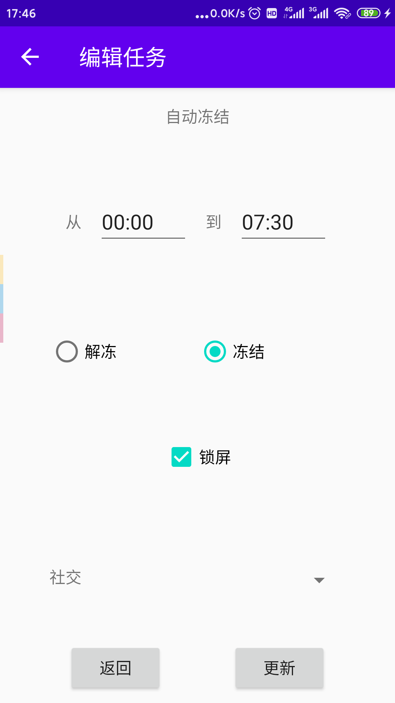

# 定时冻结

无需root，定时冻结应用或者锁定手机

# 截图











# 特性

- 定时冻结应用
- 应用分类
- 无需root
- 可以自定义时间锁定手机

# 注意事项：
1. 一个应用只能属于一个分类
2. 如果你设置了锁定屏幕，你将无法在设置的时间内打开屏幕
3. 本应用会有BUG，由于BUG或者使用不当造成后果的自行承担(例如设置了24小时锁定屏幕)

# 为啥要用这个？

通常，手机占据了我们大部分的时间，以及各种各样的信息充斥着我们的大脑。我们需要安静一会儿。

# 如何安装?

因为它不需要Root权限，因此需要一些特殊的手段来激活这个应用

## 步骤一：下载Apk,*不能*直接安装到手机，你需要使用adb工具

这是因为清单中设置了testOnly="true"
只有这样，才能更加方便卸载，否则如果app突然打不开，你将无法卸载


## 步骤二：退出所有手机账户
在设置->账户 出退出你的所有账号，例如退出小米账号

## 步骤三：打开开发者模式，打开USB调试模式

## 步骤四：下载adb工具到电脑

## 步骤五：用adb工具连接手机

### 1) 显示设备

```
PS C:\Users\lili> adb devices
List of devices attached
ccbbee44        device
emulator-5554   device
```

### 2) 连接你的设备 `adb -s [你设备的id] shell `

```
PS C:\Users\lili> adb -s emulator-5554 shell
generic_x86_64:/ $
```

## 步骤六：通过adb移除手机中其它的账户
如果你看见除了0以外的其它账户，移除它，例如移除下面的999
```
generic_x86_64:/ $ pm list users
Users:
        UserInfo{0:Owner:13} running
        xxxxx {999:xxxx} ...
```
移除999账户
```
generic_x86_64:/ $ pm remove-user 999
```

## 步骤七：利用adb安装App, 并设置该App为管理员
### 1) 安装App
先退出shell, 再安装
```
generic_x86_64:/ $ exit
PS C:\Users\lili>  adb -s [你设备的id] install -t app-release.apk
Performing Streamed Install
Success
```
## 2) 设置为管理员（关键)
```
PS C:\Users\lili>  adb -s [你设备的id] shell dpm set-device-owner com.tignioj.freezeapp/.MyDeviceAdminReceiver
Success: Device owner set to package ComponentInfo{com.tignioj.freezeapp/com.tignioj.freezeapp.MyDeviceAdminReceiver}
Active admin set to component {com.tignioj.freezeapp/com.tignioj.freezeapp.MyDeviceAdminReceiver}
```
如果出现错误
```
java.lang.IllegalStateException: Not allowed to set the device owner because there are already some accounts on the device
        at android.os.Parcel.createException(Parcel.java:1961)
        at android.os.Parcel.readException(Parcel.java:1921)
        at android.os.Parcel.readException(Parcel.java:1871)
        at android.app.admin.IDevicePolicyManager$Stub$Proxy.setDeviceOwner(IDevicePolicyManager.java:5863)
        at com.android.commands.dpm.Dpm.runSetDeviceOwner(Dpm.java:176)
        at com.android.commands.dpm.Dpm.onRun(Dpm.java:106)
        at com.android.internal.os.BaseCommand.run(BaseCommand.java:54)
        at com.android.commands.dpm.Dpm.main(Dpm.java:41)
        at com.android.internal.os.RuntimeInit.nativeFinishInit(Native Method)
        at com.android.internal.os.RuntimeInit.main(RuntimeInit.java:388)
Caused by: android.os.RemoteException: Remote stack trace:
        at com.android.server.devicepolicy.DevicePolicyManagerService.enforceCanSetDeviceOwnerLocked(DevicePolicyManagerService.java:7902)
        at com.android.server.devicepolicy.DevicePolicyManagerService.setDeviceOwner(DevicePolicyManagerService.java:7192)
        at android.app.admin.IDevicePolicyManager$Stub.onTransact(IDevicePolicyManager.java:1095)
        at android.os.Binder.execTransact(Binder.java:726)
        
```
表明步骤二和步骤六没做好，参考我下面给出的连接去寻找解决办法


# 如何卸载？

1. 做上述同样的步骤直到第五步（包括第五步）以连接到手机
2. 执行命令

```
generic_x86_64:/ $ dpm remove-active-admin com.tignioj.freezeapp/.MyDeviceAdminReceiver
Success: Admin removed ComponentInfo{com.tignioj.freezeapp/com.tignioj.freezeapp.MyDeviceAdminReceiver}
```
然后你就可以卸载它了


## 参考教程

###  1）激活
https://www.jianshu.com/p/5b1a552b5040

http://floatingmuseum.github.io/2016/07/device-admin-practice

https://www.jianshu.com/p/8934d47aed3b

https://tieba.baidu.com/p/5751579349?red_tag=0005168206

### 2）取消激活

https://stackoverflow.com/questions/13911444/disable-deviceadmin-from-shell

https://stackoverflow.com/questions/51646153/remove-device-owner-android

